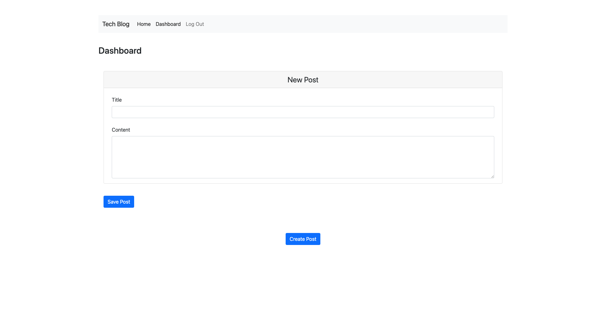
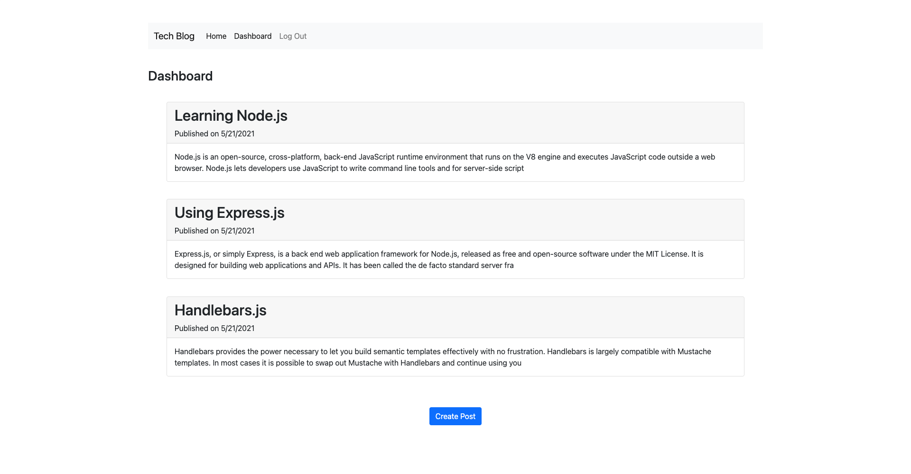

# Developer Blog

## Description

This site is a CMS-style blog site, where developers can publish their blog posts and comment on other developers’ posts as well. This app follows the MVC paradigm in its architectural structure, using Handlebars.js as the templating language, Sequelize as the ORM, and the express-session npm package for authentication.

## Table of Contents
[Screenshots](https://github.com/sranson/Developer-Blog#Screenshots)

[Deployed Site](https://github.com/sranson/Developer-Blog#deployed-site)

[Questions](https://github.com/sranson/Developer-Blog#Questions)

[Contributing](https://github.com/sranson/Developer-Blog#Contributing)

[License](https://github.com/sranson/Developer-Blog#License)

## Screenshots
 

 

## Deployed Site
[Developer Tech Blog](https://developer-blog-app.herokuapp.com/)

## Questions

[GitHub Profile](https://github.com/sranson)

Email: salomeranson@gmail.com

## Contributing

Salome Ranson

## License

[MIT](https://choosealicense.com/licenses/mit/)